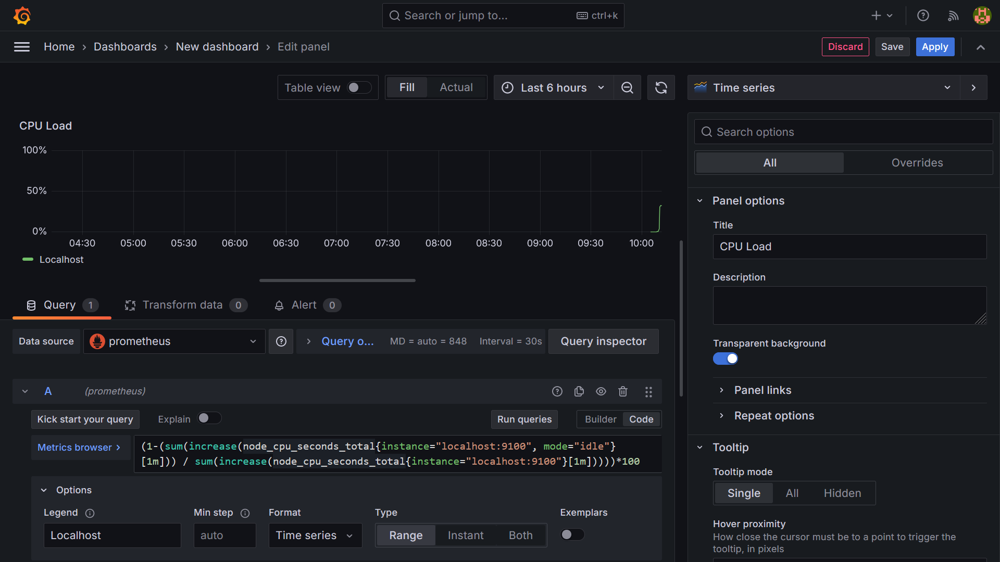
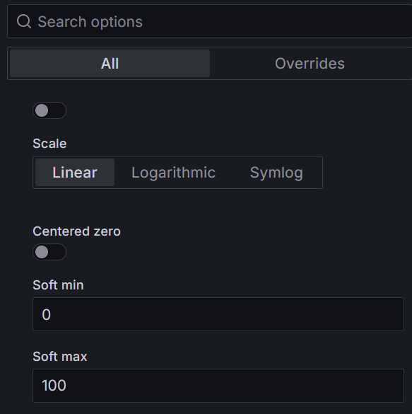
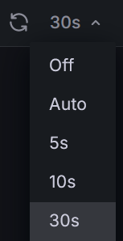

# Лабораторная работа 5: Применение Node Exporter/Prometheus и Grafana для мониторинга ресурсов.

## Шаг 1. Установка Node Exporter и первоначальная настройка.

На всякий случай для начала проверим есть ли у нас установленные пакеты `wget` и `tar` и если их нет, то установим:

`Debian: $ sudo apt install wget tar -y`

`RHEL: $ sudo yum install wget tar -y`

Cкачиваем архив с утилитой node exporter при помощи утилиты `wget`:

`$ wget https://github.com/prometheus/node_exporter/releases/download/v1.7.0/node_exporter-1.7.0.linux-amd64.tar.gz`

<blockquote>

Если это не сработало, то попробуйте найти текущую версию пакета на данном сайте:

https://prometheus.io/download/#node_exporter

И обновите команду скопировав ссылку с файла скачивания для архитектуры `linux-amd64`.

> Hint: Копировать ссылку можно нажав на название файла на сайте правой кнопкой

Если эта команда и после изменений ничего не скачает, то можно написать в Issues данного репозитория

</blockquote>

Распакуем полученный архив при помощи `tar`:

`$ tar xvfz node_exporter-*.*-amd64.tar.gz`

Заходим в дирректорию с распакованным `node_exporter`:

`$ cd node_exporter-*/`

И пробуем запустить прямо в консоли.

`$ ./node_exporter`

Если среди последних выдачи вы видите слова `msg="Listening on"` то скорее всего вы всё сделали правильно.

Теперь можно проверить действительно ли данные мониторинга отправляются с узла, для этого заходим в браузер и переходим на страницу:

`localhost:9100/metrics`

<blockquote>

Либо открываем ещё одну консоль и в ней вводим:

`$ curl localhost:9100/metrics`

После выполнения команды можно сделать скриншот и закрыть только что открытую консоль.

</blockquote>

В изначальной консоли останавливаем работу `node_exporter` нажимая `Ctrl+C`

## Шаг 2. Создание демона Node Exporter.

Переместим приложение Node Exporter в новое место для создания демона.

`$ sudo mv node_exporter /usr/local/bin`

Теперь можно удалить более ненужные файлы

`$ cd ~`

`$ rm -rf node_exporter*`

> Даже если вы тут капитально сделаете что-то не так, система вам не даст удалить слишком многого, так как вы действуете не от sudo.

И собственно заполним содержимое нового демона

`sudo nano /etc/systemd/system/node_exporter.service`

```
[Unit]
Description=Node Exporter
After=network.target

[Service]
User=node_exporter
Group=node_exporter
Type=simple
ExecStart=/usr/local/bin/node_exporter

[Install]
WantedBy=multi-user.target
```

Для созданного демона потребуется пользователь

`Debian: $ sudo adduser --system --no-create-home --group --shell /sbin/nologin node_exporter`

`RHEL: $ sudo adduser -M -r -s /sbin/nologin node_exporter`

> Тут я не полностью уверен в том что команда для Debian написана оптимально, но это работает, если есть идеи по оптимизации - отпишитесь в Issues

После создания и заполнения файла перезагрузим список доступных демонов:

`sudo systemctl daemon-reload`

Запустим демона

`sudo systemctl start node_exporter`

Включим демон в автозагрузку

`sudo systemctl enable node_exporter`

И проверим что демон работает

`sudo systemctl status node_exporter`

Теперь можно проверить действительно ли данные мониторинга отправляются от демона, для этого заходим в браузер и переходим на страницу:

`localhost:9100/metrics`

<blockquote>

Либо открываем ещё одну консоль и в ней вводим:

`$ curl localhost:9100/metrics`

После выполнения команды можно сделать скриншот и закрыть только что открытую консоль.

</blockquote>

## Шаг 3.  Установка Prometheus и первоначальная настройка.

Cкачиваем архив с утилитой Prometheus при помощи утилиты `wget`:

`$ wget https://github.com/prometheus/prometheus/releases/download/v2.51.2/prometheus-2.51.2.linux-amd64.tar.gz`

<blockquote>

Если это не сработало, то попробуйте найти текущую версию пакета на данном сайте:

https://prometheus.io/download/#prometheus

И обновите команду скопировав ссылку с файла скачивания для архитектуры `linux-amd64`.

> Hint: Копировать ссылку можно нажав на название файла на сайте правой кнопкой

Если эта команда и после изменений ничего не скачает, то можно написать в Issues данного репозитория

</blockquote>

Распакуем полученный архив при помощи `tar`:

`$ tar xvf prometheus-*.*-amd64.tar.gz`

### Конфигурация файлов

Заходим в дирректорию с распакованным `Prometheus`:

`$ cd prometheus-*/`

Создадим 2 дирректории

`$ sudo mkdir /etc/prometheus`

`$ sudo mkdir /var/lib/prometheus`

Скопируем конфигурацию Prometheus

`$ sudo cp prometheus.yml /etc/prometheus/`

Скопируем исполняемые файлы

`$ sudo cp prometheus /usr/local/bin/`

`$ sudo cp promtool /usr/local/bin/`

Скопируем библиотеки и консоли

`$ sudo cp -r consoles/ /etc/prometheus`

`$ sudo cp -r console_libraries/ /etc/prometheus`

### Инициализация конфигурации

Откроем файл основной конфигурации prometheus и заполним контентом указанным ниже:

`$ sudo nano /etc/prometheus/prometheus.yml`

```
# my global config
global:
  scrape_interval: 15s # Set the scrape interval to every 15 seconds. Default is every 1 minute.
  evaluation_interval: 15s # Evaluate rules every 15 seconds. The default is every 1 minute.
  # scrape_timeout is set to the global default (10s).

# Alertmanager configuration
alerting:
  alertmanagers:
    - static_configs:
        - targets:
          # - alertmanager:9093

# Load rules once and periodically evaluate them according to the global 'evaluation_interval'.
rule_files:
  # - "first_rules.yml"
  # - "second_rules.yml"

#=================================================
# OK DONT TOUCH!!!!!!!!!! THATS MAIN CONFIG!
# A scrape configuration containing exactly one endpoint to scrape:
# Here it's Prometheus itself.
scrape_configs:
  # The job name is added as a label `job=<job_name>` to any timeseries scraped from this config.
  - job_name: "prometheus"

    # metrics_path defaults to '/metrics'
    # scheme defaults to 'http'.

    static_configs:
      - targets: ["localhost:9090"]
# DONT TOUCH ENDS
#=================================================

  - job_name: 'node'
    scrape_interval: 30s
    static_configs:
      - targets: ['localhost:9100']
```

### Добавление пользователя и смена прав

Для смены прав на дирректории и создания демона потребуется новый пользователь

`Debian: $ sudo adduser --system --no-create-home --group --shell /sbin/nologin prometheus`

`RHEL: $ sudo adduser -M -r -s /sbin/nologin prometheus`

Теперь можно сменить права на дирректории с файлами Prometheus которые мы переносили ранее.

`$ sudo chown prometheus:prometheus /etc/prometheus`

`$ sudo chown prometheus:prometheus /var/lib/prometheus`

## Шаг 4. Создание демона Prometheus.

Запишем конфигурацию нового демона

`$ sudo nano /etc/systemd/system/prometheus.service`

```
[Unit]
Description=Prometheus
Wants=network-online.target
After=network-online.target

[Service]
User=prometheus
Group=prometheus
Type=simple
ExecStart=/usr/local/bin/prometheus \
    --config.file /etc/prometheus/prometheus.yml \
    --storage.tsdb.path /var/lib/prometheus/ \
    --web.console.templates=/etc/prometheus/consoles \
    --web.console.libraries=/etc/prometheus/console_libraries

[Install]
WantedBy=multi-user.target
```

Перезагрузим список доступных демонов:

`$ sudo systemctl daemon-reload`

Запустим демона

`$ sudo systemctl start prometheus`

Включим демон в автозагрузку

`$ sudo systemctl enable prometheus`

И проверим что демон работает

`$ sudo systemctl status prometheus`

Теперь можно проверить действительно ли данные мониторинга отправляются от демона, для этого заходим в браузер и переходим на страницу:

`localhost:9090`

Перейдя в Status -> Targets мы можем увидеть:

```
http://localhost:9100/metrics      UP
```

Что обозначает что Node Exporter и Prometheus работают.

Теперь можно удалить более ненужные файлы

`$ cd ~`

`$ rm -rf prometheus*`


## Шаг 5. Установка Grafana

> Тут методы для Debian-подобных и RHEL подобных очень сильно расходятся, распишу их отдельно друг за другом.

### Установка на Debian-based

Устанавливаем необходимые пакеты

`Debian: $ sudo apt-get install -y adduser libfontconfig1 musl`

Забираем собранный deb пакет с сайта Grafana

`Debian: $ wget https://dl.grafana.com/oss/release/grafana_10.4.2_amd64.deb`

<blockquote>

Пакет имеет формат deb так как предназначается для Debian-подобных систем... Нейминг!

</blockquote>

Устанавливаем deb пакет

`Debian: $ sudo dpkg -i grafana_10.4.2_amd64.deb`

<blockquote>

Кстати, в конце установки dpkg выдаст:

NOT starting on installation, please execute the following statements to configure grafana to start automatically using systemd

$ sudo /bin/systemctl daemon-reload

$ sudo /bin/systemctl enable grafana-server

You can start grafana-server by executing

$ sudo /bin/systemctl start grafana-server

Это прямая инструкция к запуску, даже методичка не нужна =_=

</blockquote>

### Установка на RHEL-based

RHEL чуть более брутален:

`RHEL: $ sudo yum install -y https://dl.grafana.com/oss/release/grafana-10.4.2-1.x86_64.rpm`

> That's all folks!

### Конфигурация

Немного изменим файл конфигурации

`sudo nano /etc/grafana/grafana.ini`

Нужно найти категорию [server] и раскомментировать следующие строки

```
[server]

# The IP address to bind to, empty will bind to all interfaces
http_addr = localhost

# The http port  to use
http_port = 3000
```
### Включение

Перезагрузим список демонов

`$ sudo systemctl daemon-reload`

Добавим демона в автозапуск

`$ sudo systemctl enable grafana-server`

Включим

`$ sudo systemctl start grafana-server`

И проверим включился ли, если светится зелёным надпись active - то всё сделано верно.

`$ sudo systemctl status grafana-server`

# Шаг 6. Работа с Grafana

Теперь можно проверить действительно ли Grafana работает, для этого заходим в браузер и переходим на страницу:

`localhost:3000`

Стандартным логином является `admin` с паролем `admin`.

Вам сразу же будет предложено сменить пароль, сделайте это и запомните новый пароль.

На главной странице будет

```
Data Source

Add Your first Data Source
```

Нам сюда. Выбираем Prometheus.

В меню Connection вводим

`http://localhost:9090`

Проматываем вниз страницы, жмём save and test.

Если получаем в ответ

```
Successfully queried the Prometheus API.
```

То переходим в Home (верхняя левая часть страницы) и жмём в верхней правой части страницы на кнопку + и добавляем новый Dashboard.

### Первая метрика

Оказавшись на новой странице добавляем Визуализацию выбирая Prometheus.

Для Query выберите режим Code (справа) и впишите в окно редактирование кода

`(1-(sum(increase(node_cpu_seconds_total{instance="localhost:9100", mode="idle"}[1m])) / sum(increase(node_cpu_seconds_total{instance="localhost:9100"}[1m]))))*100`

Пояснения к формуле будут потом.

Раскройте подменю Options (слева снизу) и впишите:
`localhost` или любое другое имя на ваше усмотрение.



С правой стороны можно обозначить заголовок (Tile): CPU Load

Проматывая вниз в меню Axis можно установить

`Soft Min = 0`

`Soft Max = 100`



 В Standart Options можно увидеть Unit (выберите Misc -> Percent(0-100))

Можно также их искать при помощи Search option.

Теперь можно нажать на кнопку Apply, а в открывшемся Dashboard на иконку сохранения. И назвать Dashboard как-нибудь.


<blockquote>

Рядом с кнопкой обновления есть стрелочка вниз которая позволяет установить автообновление всей статистики приведённой на странице через определённые промежутки времени.



</blockquote>

Можно подать нагрузку на процессор следующим образом:

Установим программу-бенчмарк.

`Debian: $ sudo apt install dbench`

`RHEL: $ sudo yum install dbench`

Запустим бенчмарк.

`$ dbench 1000 -t 500`

## Индивидуальные задания

> Cоответствует остатку от операции деления вашего номера зачётной книжки на 5, где получение результата 0, обозначает что у вас 5 вариант

1.	Напишите метрику grafana которая позволит узнать скорость передачи данных по сети
2.	Напишите метрику grafana которая позволит узнать процент занятой ОЗУ
3.	Напишите метрику grafana которая позволит узнать скорость передачи данных к диску
4.	Напишите метрику grafana которая позволит узнать процент занятого места на диске
5.	Напишите метрику grafana которая позволит узнать общее количество переданных данных по сети.

> Для тех кто делает в WSL - данные для основной системы Windows и Linux внутри WSL разнятся.

## Пояснение к формуле из шага 6

Итак перед нами есть вот такая конструкция:

`(1-(sum(increase(node_cpu_seconds_total{instance="localhost:9100", mode="idle"}[1m])) / sum(increase(node_cpu_seconds_total{instance="localhost:9100"}[1m]))))*100`

Здесь

`node_cpu_seconds_total` - определяет количество секунд которые процессор потратил на что либо.

`node_cpu_seconds_total{instance="localhost:9100"}` - определяет что мы пытаемся смотреть на процессор именно на нашем компьютере в node_exporter.

`node_cpu_seconds_total{instance="localhost:9100", mode="idle"}`- добавление режима idle обозначает что я хочу увидеть сколько по времени процессор простаивал.

`increase(node_cpu_seconds_total{instance="localhost:9100", mode="idle"}[1m])` Добавление параметра `increase()[1m]` подразумевает что я хочу знать сколько процессор простаивал (и сколько он всего потратил секунд) за последнюю минуту, а не за всё время от включения компьютера, так как иначе будет показываться не текущая нагрузка, а усреднённая нагрузка компьютера со времени включения.

Не помню зачем накидывал `sum()`, возможно без него не работало `:)` А если что-то работает, то не трогай.

`sum(increase(node_cpu_seconds_total{instance="localhost:9100", mode="idle"}[1m])) / sum(increase(node_cpu_seconds_total{instance="localhost:9100"}[1m]))` - деление одного на другое позволяет узнать сколько времени в долях единицы процессор простаивал. Если он простаивал 80 процентов времени, то показатель будет `0.8`

`1-(sum(increase(node_cpu_seconds_total{instance="localhost:9100", mode="idle"}[1m])) / sum(increase(node_cpu_seconds_total{instance="localhost:9100"}[1m])))` - а вычитание из 1 полученного ранее значения даст нам как раз долю единицы времени когда процессор не простаивал (то есть что-то делал!)

Ну и домножение всего этого на 100 нужно чтобы получить нагрузку в процентах, так всё это и работает.